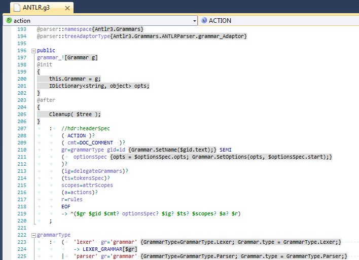
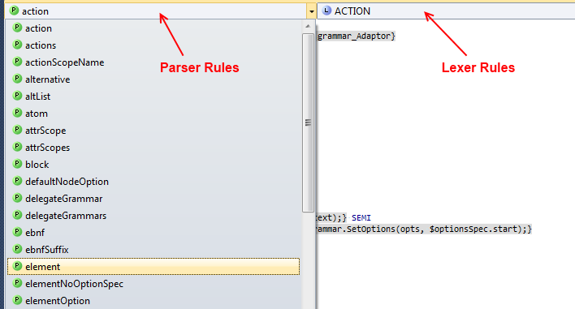
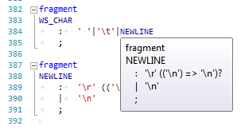
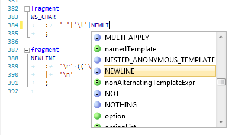
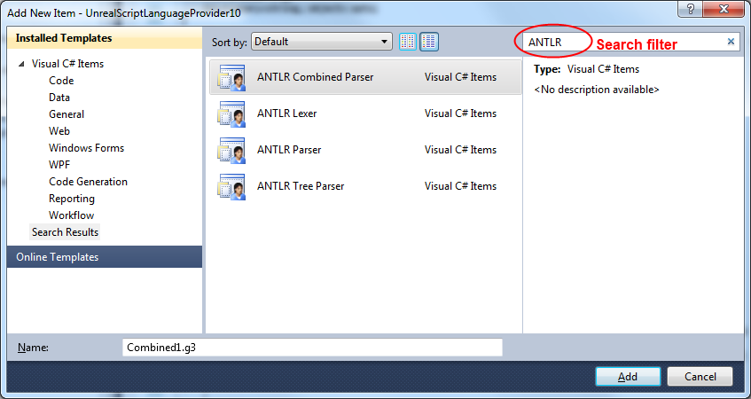
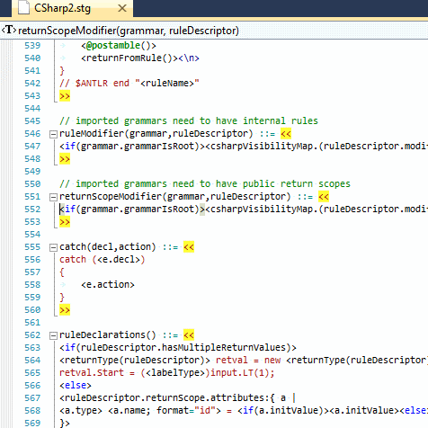

# Visual Studio and the ANTLR C# Target

:warning: This document was written several years ago, and sections may be out of date.

## Introduction

This document gives a basic overview of using ANTLR and its CSharp2 or CSharp3 target with C# projects in Visual Studio.

### Visual Studio 2010 Support for ANTLR 3 Grammars

The following extension for Visual Studio 2010 offers preliminary support for ANTLR grammars. This is an early release
of this tool, so I value any feedback you may have. The tool offers the following features.

* Syntax highlighting (Figure 1)
* Editor navigation bar (Figure 2)
* QuickInfo tooltips (Figure 3)
* Auto-completion (Figure 4)
* Project item templates for lexer, parser, combined, and tree grammars (Figure 5). These templates **DO NOT** perform
  steps 1.2 to 1.5, so you'll need to manually do that first. The templates **DO** take care of the steps in section 2
  automatically.
* StringTemplate 4 support (Figure 6)

#### Note for Existing Users

If you previously downloaded and installed a release of these tools *before* they were added to the Visual Studio
Gallery, you'll need to manually uninstall them before installing the latest versions. In the future, upgrades to
versions you download from the Visual Studio Gallery should work automatically without requiring a manual uninstall. If
you need to manually uninstall the old extensions, you can find them in the Visual Studio Extension Manager with the
following names:

* ANTLR Language Support
* StringTemplate 4 Language Support
* Visual Studio Extensibility Framework

#### Download Links

The extensions can be downloaded from the Visual Studio Gallery.

* Tunnel Vision Labs' ANTLR 3 Language Support for Visual Studio 2010
  http://visualstudiogallery.msdn.microsoft.com/25b991db-befd-441b-b23b-bb5f8d07ee9f
* Tunnel Vision Labs' StringTemplate 4 Language Support for Visual Studio 2010
  http://visualstudiogallery.msdn.microsoft.com/5ca30e58-96b4-4edf-b95e-3030daf474ff



Figure 1. Syntax highlighting for ANTLR grammars



Figure 2. Editor navigation bars for parser and lexer rules



Figure 3. QuickInfo tooltips for ANTLR v3 grammars



Figure 4. IntelliSense autocomplete for ANTLR v3 grammars



Figure 5. ANTLR project item templates for Visual C# projects



Figure 6. StringTemplate support

### Base Project Layout

* C:\dev\CoolTool\
  * CoolProject\
    * CoolProject.csproj
  * CoolTool.sln

### Adding ANTLR to the Project Structure

1. Download either the "Bootstrap" or "Tool" ANTLR C# port from the following location:
    http://www.antlr.org/wiki/display/ANTLR3/Antlr3CSharpReleases
2. Extract the files to C:\dev\CoolTool\Reference\Antlr.

After these steps, your folder should resemble the following.

* C:\dev\CoolTool\
  * CoolProject\...
  * Reference\
    * Antlr\
      * CodeGen\...
        * Targets\...
        * Tool\...
        * Antlr3.exe
        * Antlr3.exe.config
        * ...
  * CoolTool.sln

### MSBuild Support for ANTLR

Since the steps include manual modification of the Visual Studio project files, I ***very strongly*** recommend you back
up your project before attempting this (whether or not you are already comfortable with editing these files).

1. Open CoolTool.sln
2. Unload the CoolProject project (by right-clicking the project in Solution Explorer and selecting Unload Project)
3. Open CoolProject.csproj for editing (by right-clicking the unloaded project in Solution Explorer and selecting Edit
    CoolProject.csproj)
4. For reference, locate the following line:

    ```xml
    <Import Project="$(MSBuildBinPath)\Microsoft.CSharp.targets" />
    ```

5. After the line in step 4, add the code from Figure 6, below.
6. Save and close CoolProject.csproj.
7. Reload the CoolProject project (by right-clicking the project in Solution Explorer and selecting Reload Project).

```xml
<PropertyGroup>
  <!-- Folder containing AntlrBuildTask.dll -->
  <AntlrBuildTaskPath>$(ProjectDir)..\Reference\Antlr</AntlrBuildTaskPath>
  <!-- Path to the ANTLR Tool itself. -->
  <AntlrToolPath>$(ProjectDir)..\Reference\Antlr\Antlr3.exe</AntlrToolPath>
</PropertyGroup>
<Import Project="$(ProjectDir)..\Reference\Antlr\Antlr3.targets" />
```
Figure 7. MSBuild targets file reference

### Adding a Reference to the CSharp3 Runtime

1. In the CoolProject project, add a reference to Antlr3.Runtime.dll, which is located at
   "C:\dev\CoolTool\Reference\Antlr\Antlr3.Runtime.dll"

## Grammars

The generated classes are declared with the `partial` specifier, which encourages clean separation of the grammar's
rules and helper code. When used with Visual Studio, this configuration also enables the IDE's C# features. The
following table summarizes the files which get added to the project based on the type of grammar you are writing.

| Grammar Type | Declaration | Project Files |
| --- | --- | --- |
| **Lexer** | lexer grammar T; | T.g3<br>T.g3.cs |
| **Parser** | parser grammar T; | T.g3<br>T.g3.cs |
| **Combined (Lexer and Parser)** | grammar T; | T.g3<br>T.g3.lexer.cs<br>T.g3.parser.cs |
| **Tree** | tree grammar T; | T.g3<br>T.g3.cs |

Table 1. User-created files by grammar type

### Building Grammars with the Project

After adding a grammar T.g3 to the project, the following steps set the build action.

1. Right click the file T.g3 in Solution Explorer and select Properties.
2. In the Properties pane, set the Build Action to `Antlr3`.

## Custom Token Specifications (*.tokens)

The `tokenVocab` grammar option tells ANTLR to import tokens from a particular file. Normally, this file is
automatically generated while compiling another grammar from the same project, so there is no need to locate it and add
it to the project. However, if your grammar depends on a particular tokens file that is not generated by a grammar in
the same project, you'll need to include the file in your build. After you add the tokens file to your project, set its
Build Action to `AntlrTokens` to make it available as other grammars in your project are compiled.

## Generated Code

### Rules

#### Return Values

The following table summarizes the return types from rules.

| Output option | Rule "returns" spec | Parser grammar | Tree grammar |
| --- | --- | --- | --- |
| None | None | void | void |
| None | int x | int | int |
| None | int x, int y | class ruleName\_return | class ruleName\_return |
| AST | None | AstParserRuleReturnScope | AstTreeRuleReturnScope |
| AST | int x | class ruleName\_return | class ruleName\_return |
| AST | int x, int y | class ruleName\_return | class ruleName\_return |
| Template | None | TemplateParserRuleReturnScope | TemplateTreeRuleReturnScope |
| Template | int x | class ruleName\_return | class ruleName\_return |
| Template | int x, int y | class ruleName\_return | class ruleName\_return |

## Extra Features in the C# Targets

### Grammar Accessibility Modifiers

By default, grammar classes are generated as `public`. This may be changed by explicitly specifying the `modifier`. The
default constructors are also generated as `public`, but may be changed by explicitly specifying the `ctorModifier`.

```antlr
grammar MyGrammar;

options {
  language=CSharp3;
}

@modifier{internal}
@ctorModifier{private}
```

### Rule Accessibility Modifiers

With the exception of lexer rules, an accessibility modifier may be added to each rule. The available modifiers are
`public`, `protected`, and `private`, with a default of `private`.¹ The rule accessibility is included in the generated
code.

```antlr
public    rule1 : /*...*/ ;
protected rule2 : /*...*/ ;
private   rule3 : /*...*/ ;

rule4 : /*...*/ ; // same as private
```

¹ Due to a limitation in the ANTLR Tool itself, `internal` is not currently available as an accessibility modifier.

### Tree Adaptor Initialization (CSharp3 only)

A partial method `CreateTreeAdaptor` is generated, which allows the user to specify custom logic for initializing the
tree adaptor.

```csharp
partial void CreateTreeAdaptor(ref ITreeAdaptor adaptor) {
    adaptor = new CommonTreeAdaptor();
}
```
Figure 8. CreateTreeAdaptor for custom adaptors

### Grammar Construction (CSharp3 only)

The following partial method is called while constructing the parser instance.

```csharp
partial void OnCreated();
```

### Rule Entry and Exit (CSharp3 only)

The following methods are called at the entry and exit of every rule.

```csharp
partial void EnterRule(string ruleName, int ruleIndex);
partial void LeaveRule(string ruleName, int ruleIndex);
```

Entry and exit partial methods are also generated for each rule *rule*:

```csharp
partial void EnterRule_rule();
partial void LeaveRule_rule();
```

### Dynamic Attribute Scope Construction, Entry and Exit (CSharp3 only)

Dynamic attribute scope classes are also declared with the `partial` specifier. The constructor for these scopes calls
the partial method `OnCreated`, which can be implemented as follows.

```csharp
partial class GrammarName {
  partial class GlobalScopeName_scope {
    partial void OnCreated(GrammarName grammar) {
      // called when the scope is created, before it’s pushed to the scope stack
    }
  }
}
```

After a scope is pushed to the scope stack, the partial method `ScopeName_scopeInit` is called. Likewise, the partial
method `ScopeName_scopeAfter` is called immediately before the scope is popped from the stack.

```csharp
partial class GrammarName {
  partial void GlobalScopeName_scopeInit(GlobalScopeName_scope scope) {
    // called immediately after the scope is pushed to the scope stack
  }
  partial void GlobalScopeName_scopeAfter(GlobalScopeName_scope scope) {
    // called immediately before the scope is popped from the scope stack
  }
}
```

### Rule Return Values (CSharp3 only)

Parser rules with multiple return values return a generated class. This class is generated with the `partial` specifier,
and includes a constructor which calls the partial method `OnCreated`.

```csharp
partial class GrammarName {
  partial class RuleName_return {
    partial void OnCreated(GrammarName grammar) {
      // called when the return value is initialized
    }
  }
}
```

### Extended AST Operators

Release 3.4 of the CSharp2 and CSharp3 targets include some extended features for AST operators. These features allow
the use of the more efficient AST operator syntax in several common cases that previously required rewrite syntax.

```antlr
// rewrite syntax
rule
  : LPAREN elements RPAREN
    -> ^(VALUE[$LPAREN] elements)
  ;

// Short extended AST syntax (Only works when generating code with Antlr3.exe)
rule
  : LPAREN<VALUE>^ elements RPAREN!
  ;

// Full extended AST syntax (Works when using the Antlr3.exe or the Java version of the Tool)
rule2
  : LPAREN<ttype=VALUE>^ elements RPAREN!
  ;
```
Figure 9. Specifying the Type property of an AST node

```antlr
// rewrite syntax
rule
  : LPAREN elements RPAREN
    -> ^(VALUE[$LPAREN, "value"] elements)
  ;

// Extended AST syntax
rule
  : LPAREN<ttype=VALUE; text="value">^ elements RPAREN!
  ;
```
Figure 10. Specifying the Type and Text properties of an AST node

## Example Grammars

### Combined Grammar

```antlr
grammar T;

options {
  language=CSharp3;
  TokenLabelType=CommonToken; // Specifies the token type for parsers
  output=AST;                 // Specify AST creation
  ASTLabelType=CommonTree;    // Specify tree node type for AST output
}

@lexer::namespace {CoolTool.CoolProject.Compiler}
@parser::namespace {CoolTool.CoolProject.Compiler}

// PARSER
//

public
compileUnit
  : /*...*/ EOF
  ;

// LEXER
//

IDENTIFIER
  : ('a'..'z' | 'A'..'Z' | '_') ('a'..'z' | 'A'..'Z' | '0'..'9' | '_')*
  ;
```
Figure 11. Combined grammar T.g

```csharp
namespace CoolTool.CoolProject.Compiler {
  partial class TLexer {
  }
}
```
Figure 12. Lexer helper file TLexerHelper.cs

```csharp
namespace CoolTool.CoolProject.Compiler {
  partial class TParser {
  }
}
```
Figure 13. Parser helper file TParserHelper.cs
